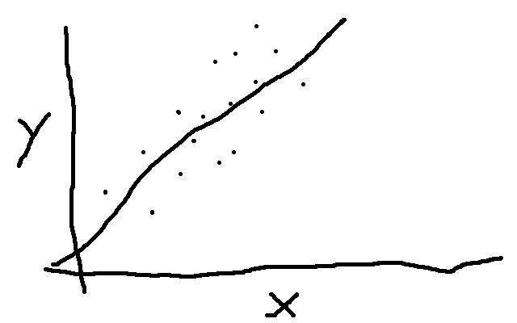
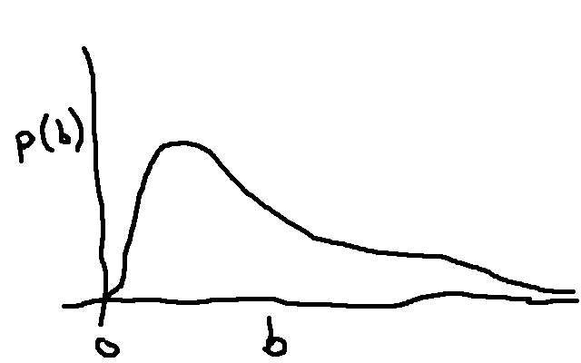
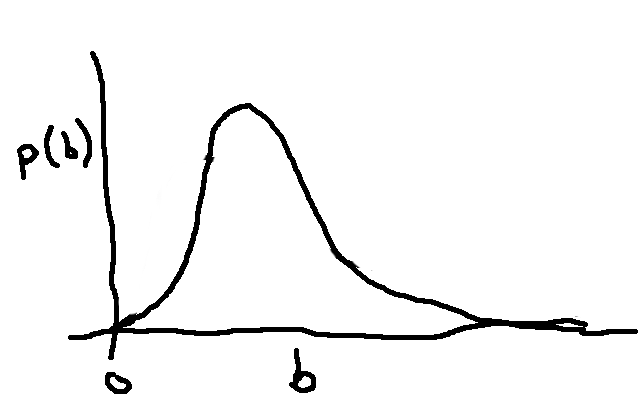
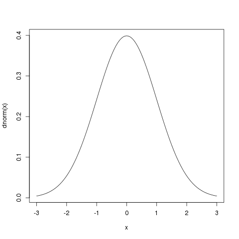
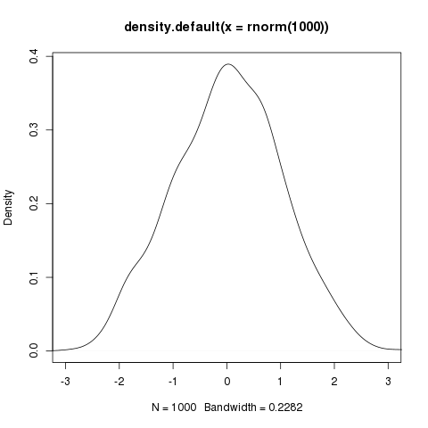
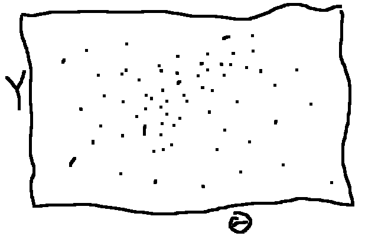
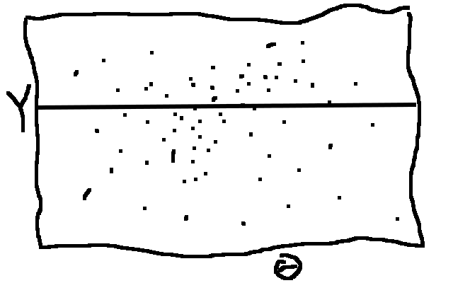
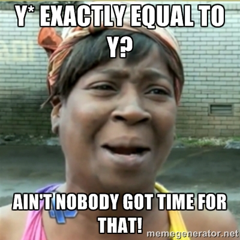

% ABC and Rcpp
% Michael Lerch

Bayesian Analysis
=================

----------------------

Model and Likelihood

. . .



. . .

$$y = m * x + b$$

. . .

$$\mu = m * x + b$$

----------------------

Likelihood


. . .

$$y = \mu + \epsilon$$

$$\epsilon \sim N(0, \sigma)$$

----------------------

### Parameters ###

<br />

- The slope, $m$

- The intercept, $b$

- The variability, $\sigma$

- Collectively, $\theta$

----------------------

### Likelihood ###

<br />

$$P(Y | \theta)$$

$$P(Y | \theta, X)$$

----------------------

### Prior ###



$$P(\theta)$$

----------------------

### Bayes Rule ###

<br />

$$P(\theta | Y) = \frac{P(Y|\theta)P(\theta)}{P(Y)}$$

----------------------

### Posterior ###


$$P(\theta | Y)$$

----------------------

### Posterior ###



$$P(\theta | Y)$$

----------------------

### Using the posterior ###


----------------------

### Denominator ###
<br />

$$P(\theta | Y) = \frac{P(Y|\theta)P(\theta)}{P(Y)}$$

Sampling the posterior
======================

----------------------

### Algorithms you may have heard of ###

<br />

- Metropolis-Hastings

- Gibbs

----------------------

```
curve(dnorm(x), xlim = c(-3, 3)
```



----------------------

```
plot(density(rnorm(1000)), xlim = c(-3, 3))
```



----------------------

### "Rejection sampling" ###

<br />

Sample from the joint distribution, $P(\theta, Y) = P(\theta)P(Y|\theta)$



----------------------

### "Rejection sampling" ###

<br />

Reject when the sampled $Y$ does not equal the observed



----------------------

### Algorithm ###

<br />

1. Sample $\theta^*$ from the prior: $P(\theta)$
2. Sample $Y^*$ from the likelihood: $P(Y|\theta^*)$
3. If $Y^*$ is equal to the observed data, keep $\theta^*$, if not reject.

----------------------



----------------------

### Speeding it up ###

<br />

1. Summary statistics (perhaps sufficient)
2. Add some wiggle room

----------------------

### Why use ABC? ###

<br />

Complicated likelihood

Rcpp
====

----------------------

### Basic idea ###

<br />

Write code in C++, run in R

Because C++ is faster than R

----------------------

### Is Rcpp necessary? ###

<br />

No but it makes things a bit easier

----------------------

### How scared should I be of C++? ###

<br />

>- Equal signs, not assignment arrows
>- Semi-colons at the end of lines
>- Indexing starts at 0
>- For loops have a different structure
>- Type definitions

----------------------

### Example ###

<br />

Fibonacci sequence

1, 1, 2, 3, 5, 8, 13, 21, 34, ...
